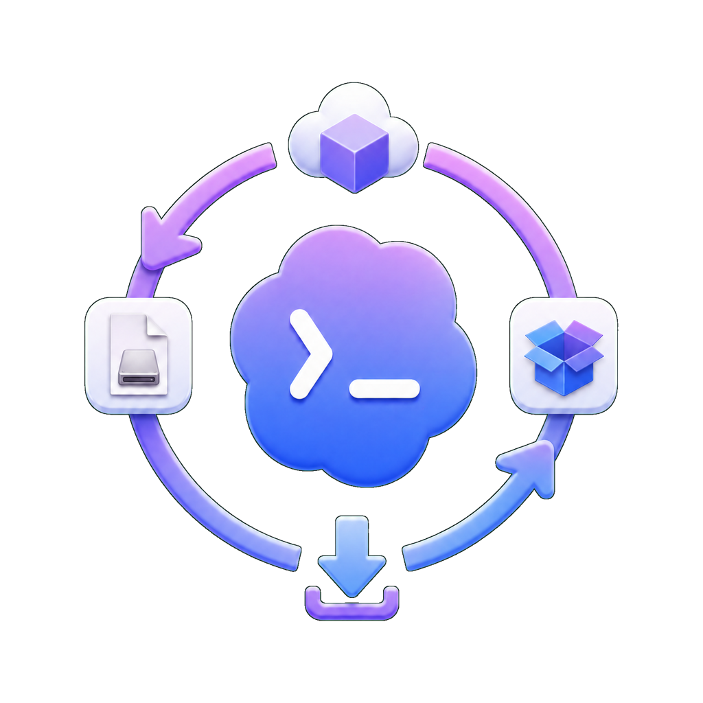

<p align="center">
  
</p>

<h1 align="center">codex-app-mirror</h1>

<p align="center">
  Mirror official Codex desktop app installers into GitHub Releases.
</p>

<p align="center">
  <a href="https://github.com/Wangnov/codex-app-mirror/releases/latest"></a>
  <a href="https://github.com/Wangnov/codex-app-mirror/actions/workflows/mirror.yml"></a>
  <a href="https://github.com/Wangnov/codex-app-mirror/actions/workflows/mirror.yml"></a>
  <a href="https://apps.microsoft.com/detail/9plm9xgg6vks"></a>
  <a href="https://github.com/Wangnov/codex-app-mirror/releases/latest"></a>
  <a href="https://github.com/Wangnov/codex-app-mirror/releases/latest"></a>
</p>

<p align="center">
  
  
  
  
</p>

<p align="center">
  <a href="#readme-cn">中文</a> · <a href="#readme-en">English</a>
</p>

<p align="center">
  GitHub Release · Microsoft Store MSIX · macOS DMG · checksums · release manifest
</p>

---

<a id="readme-cn"></a>

# 中文

有时候你只是想在一台 Windows 电脑上装 Codex App，但 Microsoft Store 下载链路不配合：商店被裁剪、AppX 服务关了、账号策略卡住，或者 GitHub Actions 里 `winget download` 因为 Store 包需要 Entra ID 认证而不能无人值守运行。

`codex-app-mirror` 做的事情很窄：它不构建、不修改、不重打包 Codex，只把当前官方来源里的 Codex 桌面安装包拉下来，按版本探测结果发布到 GitHub Release。这样你可以从一个稳定的 Release 页面拿到 Windows MSIX 和 macOS DMG，并用随附的校验和核对文件。

## 镜像内容

- Windows x64 MSIX：Microsoft Store ProductId `9PLM9XGG6VKS`
- macOS Apple Silicon DMG：OpenAI Codex App 官方下载地址
- macOS Intel DMG：OpenAI Codex App 官方下载地址
- `SHA256SUMS.txt`：本次 Release 内所有资产的总校验和
- `release-manifest.json`：本次探测到的上游指纹

当前 Windows 包名形如：

```text
OpenAI.Codex_<version>_x64__2p2nqsd0c76g0.Msix
```

## 怎么用

打开 [最新 GitHub Release](https://github.com/Wangnov/codex-app-mirror/releases/latest)，下载你的平台对应文件：

- Windows：下载 `OpenAI.Codex_..._x64__2p2nqsd0c76g0.Msix`
- Apple Silicon Mac：下载 `Codex-mac-arm64.dmg`
- Intel Mac：下载 `Codex-mac-x64.dmg`

建议同时下载 `SHA256SUMS.txt`，核对文件没有在下载过程中损坏。

## 自动轮询

GitHub Actions 每 15 分钟运行一次 `Mirror Codex App Installers` workflow。

每次运行先做轻量探测：

- Windows：通过 Microsoft Store DisplayCatalog 拿到 `WuCategoryId`，再用 FE3 metadata 解析当前 MSIX moniker 和临时 Microsoft CDN URL
- macOS：对两个 OpenAI DMG URL 做 HEAD 请求，读取 `ETag`、`Last-Modified` 和 `Content-Length`
- 比对：和最新 Release 的 `release-manifest.json` 做稳定字段比较

如果没有新版本，workflow 会在探测阶段结束，不下载安装包，也不发布重复 Release。

如果发现任意平台版本变化，workflow 会下载三个平台的安装包，生成校验和和 manifest，然后发布新的 GitHub Release。

## 上游来源

macOS DMG 使用 OpenAI Codex 桌面安装器的官方静态地址：

- `https://persistent.oaistatic.com/codex-app-prod/Codex.dmg`
- `https://persistent.oaistatic.com/codex-app-prod/Codex-latest-x64.dmg`

Windows MSIX 使用 Microsoft Store metadata 解析：

- DisplayCatalog：查询 ProductId `9PLM9XGG6VKS`
- FE3：获取与当前 Windows Desktop x64 条件匹配的包 metadata
- Microsoft CDN：下载 FE3 返回的临时包 URL

仓库内的解析器是纯 .NET 实现，不依赖 `StoreLib` 这类第三方 Store helper 包。

## 这个仓库不会做什么

- 不修改 Codex 安装包
- 不破解 Microsoft Store 或 OpenAI 的授权逻辑
- 不保留 Microsoft CDN 临时 URL 作为长期下载地址
- 不保证安装包能绕过你本机的 Windows AppX / MSIX 安装策略
- 不替代 OpenAI、Microsoft 或 Microsoft Store 的官方分发渠道

---

<a id="readme-en"></a>

# English

Sometimes you just want to install the Codex desktop app on Windows, but the Microsoft Store path is not available: the Store has been removed, AppX services are disabled, account policy blocks the download, or an unattended GitHub Actions runner cannot use `winget download` because Store packaged apps require Entra ID authentication.

`codex-app-mirror` keeps the job deliberately narrow. It does not build, modify, or repackage Codex. It downloads the current official installer packages from their upstream sources and publishes them as GitHub Release assets when the upstream fingerprints change.

## Mirrored Assets

- Windows x64 MSIX from Microsoft Store ProductId `9PLM9XGG6VKS`
- macOS Apple Silicon DMG from the official OpenAI Codex App URL
- macOS Intel DMG from the official OpenAI Codex App URL
- `SHA256SUMS.txt` for all assets in the release
- `release-manifest.json` with the upstream fingerprints used by the polling check

The Windows asset is named like this:

```text
OpenAI.Codex_<version>_x64__2p2nqsd0c76g0.Msix
```

## Usage

Open the [latest GitHub Release](https://github.com/Wangnov/codex-app-mirror/releases/latest) and download the asset for your platform:

- Windows: `OpenAI.Codex_..._x64__2p2nqsd0c76g0.Msix`
- Apple Silicon Mac: `Codex-mac-arm64.dmg`
- Intel Mac: `Codex-mac-x64.dmg`

Download `SHA256SUMS.txt` as well if you want to verify that the file arrived intact.

## Polling

The `Mirror Codex App Installers` workflow runs every 15 minutes.

Each run starts with a lightweight probe:

- Windows: query Microsoft Store DisplayCatalog for ProductId `9PLM9XGG6VKS`, then use FE3 metadata to resolve the current MSIX moniker and temporary Microsoft CDN URL
- macOS: HEAD the two OpenAI DMG URLs and read `ETag`, `Last-Modified`, and `Content-Length`
- Compare: check those stable fields against the latest release's `release-manifest.json`

If nothing changed, the workflow stops after the probe. It does not download installers and does not publish a duplicate release.

If any platform changes, the workflow downloads all three installers, writes checksums and a manifest, and publishes a new GitHub Release.

## Upstream Sources

macOS DMGs use the official OpenAI Codex desktop app URLs:

- `https://persistent.oaistatic.com/codex-app-prod/Codex.dmg`
- `https://persistent.oaistatic.com/codex-app-prod/Codex-latest-x64.dmg`

The Windows MSIX is resolved from Microsoft Store metadata:

- DisplayCatalog: query ProductId `9PLM9XGG6VKS`
- FE3: resolve package metadata matching a Windows Desktop x64 device
- Microsoft CDN: download the temporary package URL returned by FE3

The resolver in this repository is implemented directly with .NET and does not depend on third-party Store helper packages such as `StoreLib`.

## Non-Goals

- It does not modify Codex installer packages
- It does not bypass Microsoft Store or OpenAI authorization
- It does not preserve Microsoft CDN temporary URLs as permanent links
- It does not guarantee that your local Windows AppX / MSIX installation policy will accept the package
- It is not a replacement for the official OpenAI, Microsoft, or Microsoft Store distribution channels
